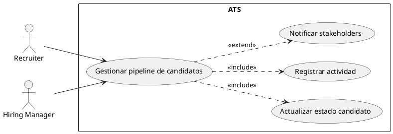
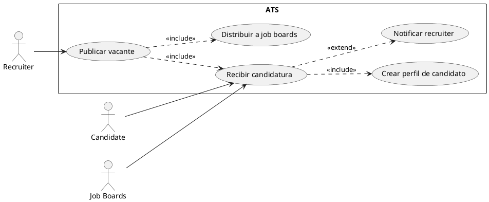
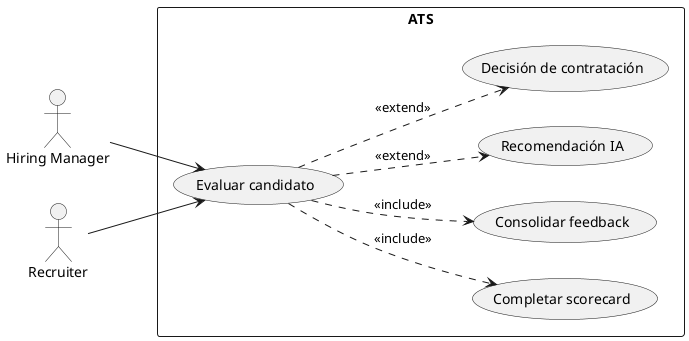
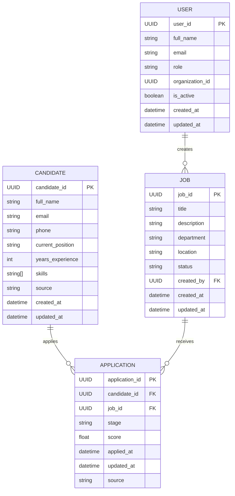
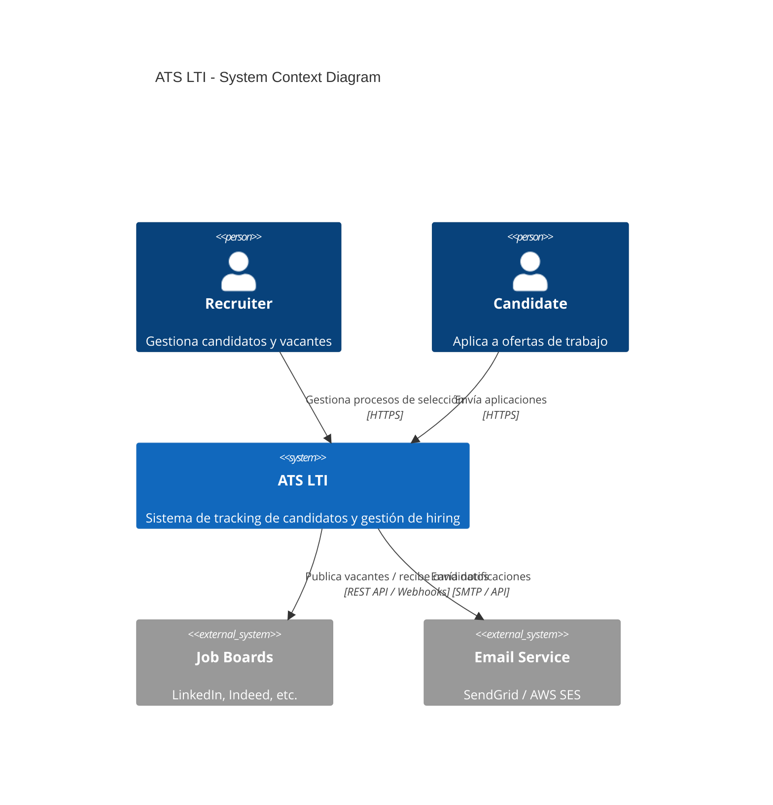
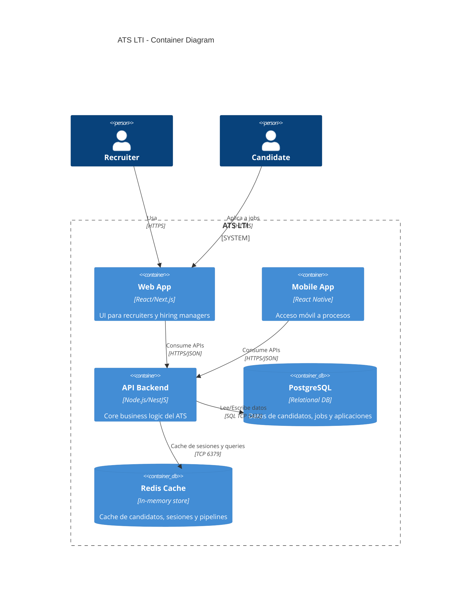
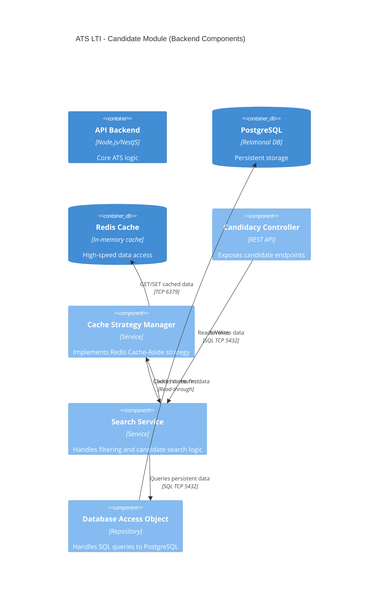

# 🧠 Análisis Completo de Applicant Tracking Systems (ATS)

## LTI – Investigación de Producto (PM Perspective)

---

# 1. 🎯 Rol del análisis

Eres un Product Manager senior especializado en SaaS B2B, HR Tech y sistemas ATS, enfocado en diseño de producto, roadmap y escalabilidad.

El objetivo de este documento es consolidar todo el análisis inicial sobre ATS para la startup LTI.

---

# 2. 🌍 Contexto del producto

LTI quiere construir un Applicant Tracking System (ATS) de nueva generación cuyo objetivo es:

- Superar soluciones actuales del mercado
- Mejorar eficiencia del recruiting
- Automatizar procesos mediante IA
- Optimizar colaboración entre equipos
- Mejorar experiencia de candidatos

---

# 3. 📦 Funcionalidades básicas de un ATS (ordenadas por prioridad)

## 🔴 1. Gestión de candidatos

- Base de datos centralizada
- Perfiles completos (CV, experiencia, actividad)
- Historial de interacciones
- Búsqueda y filtrado avanzado

## 🔴 2. Gestión de vacantes

- Creación de jobs
- Publicación en canales
- Estados de vacantes
- Asignación de candidatos

## 🔴 3. Pipeline de selección

- Etapas personalizables
- Vista kanban o funnel
- Movimiento de candidatos
- Automatización básica de estados

## 🔴 4. Recepción de candidaturas

- Career pages
- Formularios de aplicación
- Integración con job boards
- Importación de CVs

## 🔴 5. Comunicación

- Emails desde plataforma
- Plantillas
- Automatizaciones básicas
- Tracking de conversaciones

## 🟠 6. Evaluación y colaboración

- Scorecards
- Feedback estructurado
- Comentarios internos

## 🟠 7. Gestión de entrevistas

- Scheduling
- Integración con calendarios
- Coordinación de entrevistadores

## 🟠 8. Roles y permisos

- Usuarios y roles
- Accesos por equipo

## 🟡 9. Reporting y analítica

- Time-to-hire
- Conversion rates
- Dashboards

## 🟡 10. Compliance

- GDPR
- Consentimiento
- Auditoría

## 🟡 11. Integraciones

- Job boards
- Email
- Calendarios
- HRIS

## 🔵 12. Career site

- Página de empleo
- Branding básico

## ⚪ 13. Automatización

- Emails automáticos
- Asignación de candidatos
- Reglas simples

---

# 4. 💡 Beneficios de un ATS para clientes

## 🔴 1. Reducción del time-to-hire

- Procesos más rápidos
- Menor coste de vacantes abiertas

## 🔴 2. Ahorro de tiempo operativo

- Menos tareas manuales
- Mayor productividad del equipo

## 🔴 3. Mejora de calidad de contratación

- Evaluación estructurada
- Menos sesgos

## 🔴 4. Centralización del proceso

- Visibilidad total del pipeline

## 🟠 5. Candidate experience

- Comunicación más fluida
- Menos ghosting

## 🟠 6. Colaboración interna

- Alineación recruiter + hiring manager

## 🟠 7. Decisiones data-driven

- Métricas claras

## 🟡 8. Escalabilidad

- Soporta crecimiento de hiring

## 🟡 9. Compliance

- GDPR y auditoría

## 🟡 10. Employer branding

- Mejor percepción del proceso

## 🟡 11. Optimización de sourcing

- Mejores canales

## 🟡 12. Talent pool

- Reutilización de candidatos

---

# 5. 🔁 Alternativas a un ATS

## 🔴 1. Email + Excel

- Manual tracking
- Bajo coste
- No escalable

## 🔴 2. Notion / Airtable / Trello

- ATS DIY
- Flexible
- Falta automatización

## 🟠 3. HRIS con módulo ATS

- Personio, Factorial
- Integrado con HR
- Menos potente en recruiting

## 🟠 4. Agencias de recruiting

- Externalización
- Alto coste

## 🟠 5. LinkedIn Recruiter

- Sourcing outbound
- No gestión completa del funnel

## 🟡 6. Software nicho

- Casos específicos

## 🟡 7. Procesos manuales

- No estructurado
- Muy ineficiente

---

# 6. 🧭 Customer Journey de un ATS

## 1. Detección de necesidad

- Hiring request
- Budget approval

## 2. Creación de vacante

- Job definition
- Pipeline setup

## 3. Publicación

- Job boards
- Career page

## 4. Recepción de candidatos

- Aplicaciones
- Parsing CV

## 5. Screening

- Filtro inicial
- Rechazo o avance

## 6. Entrevistas

- Scheduling
- Evaluación

## 7. Decisión

- Feedback
- Comparación

## 8. Oferta

- Negotiation

## 9. Cierre

- Hiring decision

## 10. Onboarding

- Transferencia HRIS

## 11. Analítica

- KPIs

## 12. Talent pool

- Reutilización

---

# 7. 🧩 ATS Open Source

## 🔴 OpenCATS

- El más conocido
- Legacy PHP system
- Muy usado históricamente
- UX anticuada

## 🟠 FreeATS

- Más moderno
- UX mejorada

## 🟠 Reqcore

- Proyecto emergente
- Stack moderno

## 🟠 Odoo Recruitment

- Parte de ERP

## 🟠 ERPNext

- HR suite open source

## 🟠 OrangeHRM

- HRIS con módulo ATS

## 🟡 Otros (CandidATS, YAWIK)

- Poco mantenimiento

### 🧠 Insight

- Open source ATS no compite con SaaS moderno
- Principal uso: control, customización, coste cero

---

# 8. 🏢 ATS comerciales más conocidos

## Principales players

- Greenhouse
- Lever
- Workable
- Ashby
- iCIMS
- SmartRecruiters
- BambooHR (HRIS)

---

# 9. 📊 Comparativa de ATS comerciales

## (a) Automatización e IA

- iCIMS → muy fuerte (enterprise AI)
- Ashby → muy avanzado en automatización
- Workable → buen equilibrio
- Greenhouse → estructurado pero menos AI
- Lever → moderado
- BambooHR → bajo

## (b) Colaboración con hiring managers

- Greenhouse → mejor estructuración
- Lever → mejor UX
- SmartRecruiters → enterprise collaboration
- Workable → simple y ágil
- Ashby → más técnico

## (c) Candidate experience + analítica

- Lever → mejor UX
- Ashby → mejor analítica
- Greenhouse → muy sólido en reporting
- SmartRecruiters → buena experiencia global
- Workable → correcto

---

# 🏆 Ranking global

## 🥇 Greenhouse

- Mejor equilibrio estructurado enterprise

## 🥈 Lever

- Mejor UX y colaboración

## 🥉 Ashby

- Mejor data + automatización moderna

## 🏢 iCIMS

- Mejor enterprise AI

## 🚀 Workable

- Mejor SMB

---

# 10. 🧠 Insights estratégicos clave

## 1. Competencia real del ATS

- Excel / Notion
- HRIS
- Fricción organizacional

## 2. Drivers de adopción

- Aumento de hiring volume
- Caos operativo
- Necesidad de métricas
- Necesidad de colaboración

## 3. Segmentación del mercado

- Enterprise (Greenhouse, iCIMS)
- Mid-market (Lever, Ashby)
- SMB (Workable, HRIS)

## 4. Problema estructural del mercado

- ATS tradicionales son complejos o rígidos
- Herramientas DIY son flexibles pero ineficientes

---

# 11. 🚀 Oportunidad para LTI

## Hueco de mercado

Un ATS de nueva generación debería combinar:

- IA real (no solo scoring)
- UX tipo Lever
- Analytics tipo Ashby
- Estructura tipo Greenhouse
- Simplicidad tipo Workable

## Posicionamiento ideal

> “El ATS más inteligente y fácil de usar del mercado”

---

# 12. 🧭 Conclusión general

El mercado ATS está fragmentado entre:

- Complejidad enterprise
- Herramientas DIY
- HRIS generalistas

👉 La oportunidad está en crear un ATS:

- Más simple
- Más inteligente
- Más automatizado
- Más centrado en experiencia humana

---

## PRD – LTI Applicant Tracking System (ATS)

---

# 1. Visión Estratégica

## Definición del Problema

El proceso de reclutamiento actual en empresas en crecimiento es fragmentado, manual y poco escalable. Los equipos de RRHH gestionan candidatos a través de Excel, emails y herramientas no especializadas, lo que genera:

- Pérdida de candidatos por falta de seguimiento
- Baja eficiencia operativa del equipo de recruiting
- Mala experiencia del candidato
- Falta de visibilidad y datos para toma de decisiones

## Valor Añadido (Propuesta de Valor)

LTI es un ATS de nueva generación que centraliza, automatiza e incorpora inteligencia artificial en el proceso de contratación, mejorando la eficiencia del equipo y la calidad de contratación.

- Reducción del time-to-hire mediante automatización inteligente
- Mejora de la colaboración entre recruiters y hiring managers
- Decisiones basadas en datos y scoring inteligente de candidatos

## Ventajas Competitivas

- UX simplificada tipo “consumer-grade” para adopción rápida
- Automatización e IA aplicada a screening, matching y comunicación
- Arquitectura API-first para integraciones rápidas con HRIS y job boards
- Motor de workflow flexible y configurable sin soporte técnico
- Analítica avanzada en tiempo real sobre funnel de contratación

---

# 2. Objetivos y Métricas de Éxito

## KPIs (Objetivos Medibles)

- Reducción del time-to-hire en ≥ 25%
- Tasa de adopción activa del producto ≥ 70% de usuarios mensuales
- Incremento del candidate response rate ≥ 30%
- Automatización de al menos 40% de tareas manuales de recruiting

## Criterios de Éxito del MVP

- Creación y gestión completa de pipeline sin fricción crítica
- Publicación de vacantes en al menos 3 canales integrados
- Uso activo semanal por recruiters y hiring managers
- Feedback estructurado implementado en ≥ 80% de procesos activos
- Cero bloqueos críticos en workflows básicos de contratación

---

# 3. Especificaciones de Producto

## Funciones Principales

### 1. Gestión de candidatos

- Base de datos centralizada
- Perfil completo con CV, historial y actividad
- Búsqueda avanzada y filtros inteligentes

### 2. Gestión de vacantes

- Creación de jobs estructurados
- Publicación multi-canal
- Configuración de estados del pipeline

### 3. Pipeline de selección

- Vista kanban del proceso
- Etapas configurables
- Automatización de movimientos de candidatos

### 4. Comunicación y automatización

- Emails automáticos y personalizados
- Templates de comunicación
- Tracking de interacciones

### 5. Evaluación y colaboración

- Scorecards estructurados
- Feedback centralizado
- Comentarios internos por candidato

### 6. Analítica e IA

- Dashboards de funnel de contratación
- Scoring automático de candidatos
- Recomendación de candidatos por job fit

---

## User Stories Principales

- Como recruiter, quiero gestionar candidatos en un pipeline visual para optimizar el seguimiento del proceso.
  - Criterio: puedo mover candidatos entre etapas sin fricción

- Como hiring manager, quiero dejar feedback estructurado para mejorar la calidad de decisión.
  - Criterio: el feedback queda centralizado y accesible por el equipo

- Como recruiter, quiero automatizar la comunicación con candidatos para reducir tareas manuales.
  - Criterio: emails automáticos se envían según reglas del workflow

- Como HR manager, quiero visualizar métricas del proceso para optimizar el hiring funnel.
  - Criterio: dashboards actualizados en tiempo real

- Como sistema, quiero recomendar candidatos relevantes para acelerar el screening.
  - Criterio: ranking automático basado en skills y experiencia

---

## Requisitos Funcionales (MoSCoW)

| Requisito                    | Descripción                                         | Prioridad |
| :--------------------------- | :-------------------------------------------------- | :-------- |
| Gestión de candidatos        | Base de datos central con CVs, historial y búsqueda | Must      |
| Pipeline de contratación     | Gestión visual de etapas del proceso                | Must      |
| Publicación de vacantes      | Multi-channel job posting                           | Must      |
| Comunicación con candidatos  | Emails automatizados y manuales                     | Must      |
| Scorecards de evaluación     | Feedback estructurado por entrevistas               | Must      |
| Analítica básica             | Métricas de hiring funnel                           | Must      |
| Automatización de workflows  | Reglas simples de automatización                    | Should    |
| Integración con calendarios  | Scheduling de entrevistas                           | Should    |
| IA de ranking de candidatos  | Scoring automático por match                        | Could     |
| Talent pool inteligente      | Reutilización de candidatos                         | Could     |
| IA generativa para mensajes  | Redacción automática de emails                      | Could     |
| Integraciones avanzadas HRIS | Sincronización completa con HR systems              | Could     |

---

# 4. Modelo de Negocio (Lean Canvas)

| Bloque                       | Puntos Clave                                                                                                                              |
| :--------------------------- | :---------------------------------------------------------------------------------------------------------------------------------------- |
| **Problema**                 | 1. Procesos de recruiting manuales y fragmentados 2. Baja visibilidad del pipeline de contratación 3. Mala experiencia de candidato |
| **Segmentos de Clientes**    | 1. Startups en crecimiento (10–200 empleados) 2. Equipos de HR en mid-market 3. Empresas tech con alto volumen de hiring            |
| **Propuesta de Valor Única** | 1. ATS simple, inteligente y automatizado 2. IA aplicada al proceso de selección 3. Mejora radical de velocidad y colaboración      |
| **Solución**                 | 1. Pipeline visual + automatización de workflows 2. IA para ranking y comunicación 3. Analítica en tiempo real del funnel           |
| **Canales**                  | 1. Venta outbound B2B 2. Integraciones con HRIS marketplaces 3. Contenido y SEO en HR Tech                                          |
| **Flujos de Ingresos**       | 1. Suscripción SaaS por usuario/mes 2. Pricing por volumen de candidatos 3. Planes enterprise personalizados                        |
| **Estructura de Costos**     | 1. Infraestructura cloud y IA 2. Desarrollo de producto 3. Adquisición de clientes (sales & marketing)                              |
| **Métricas Clave**           | 1. Time-to-hire reduction 2. Active recruiters monthly 3. Candidate conversion rate                                                 |
| **Ventaja Especial**         | 1. Data network effects en hiring 2. UX superior frente a incumbentes 3. Automatización IA embedded end-to-end                      |

# 📘 Diagramas de Casos de Uso (UML) – ATS LTI

## Documento Técnico (PlantUML)

---

# 🧩 Caso de Uso 1: Gestión del pipeline de candidatos

## 1. Definición técnica

**Actor principal:**

- Recruiter

**Actores secundarios:**

- Hiring Manager
- Sistema ATS

**Precondiciones:**

- Vacante creada y activa
- Candidatos existentes en el sistema
- Usuario autenticado con permisos de recruiter

**Flujo principal:**

1. El recruiter accede a una vacante activa.
2. Visualiza el pipeline de candidatos.
3. Mueve candidatos entre etapas (screening, interview, offer).
4. El sistema actualiza el estado en tiempo real.
5. Se registra la actividad en el historial del candidato.
6. Se notifican stakeholders si corresponde.

## 2. Requisitos técnicos (UML)

- <<include>> Actualizar estado del candidato
- <<include>> Registrar actividad del candidato
- <<extend>> Notificar stakeholders

## 3. Diagrama UML (PlantUML)

> **Nota de renderizado:** Los bloques PlantUML no se previsualización en GitHub por defecto. Para ver el diagrama, usa [PlantText](https://www.planttext.com/) o copia el código en el [servidor oficial de PlantUML](https://www.plantuml.com/plantuml/uml/).

---

# 🧩 Caso de Uso 2: Publicación de vacantes y adquisición de candidatos

## 1. Definición técnica

**Actor principal:**

- Recruiter / HR Admin

**Actores secundarios:**

- Job Boards (LinkedIn, Indeed, etc.)
- Candidato externo
- Sistema ATS

**Precondiciones:**

- Usuario con permisos de creación de vacantes
- Integraciones con job boards activas

**Flujo principal:**

1. El recruiter crea una nueva vacante.
2. Define descripción, requisitos y pipeline.
3. Publica la vacante.
4. El ATS distribuye la oferta a job boards.
5. Los candidatos aplican desde múltiples canales.
6. El ATS centraliza todas las candidaturas.

## 2. Requisitos técnicos (UML)

- <<include>> Distribuir vacante a job boards
- <<include>> Recibir candidaturas
- <<include>> Crear perfil de candidato
- <<extend>> Notificar recruiter de nueva aplicación

## 3. Diagrama UML (PlantUML)

> **Nota de renderizado:** Los bloques PlantUML no se previsualización en GitHub por defecto. Para ver el diagrama, usa [PlantText](https://www.planttext.com/) o copia el código en el [servidor oficial de PlantUML](https://www.plantuml.com/plantuml/uml/).

---

# 🧩 Caso de Uso 3: Evaluación y decisión de contratación

## 1. Definición técnica

**Actor principal:**

- Hiring Manager

**Actores secundarios:**

- Recruiter
- Sistema ATS

**Precondiciones:**

- Candidatos en fase de entrevista
- Scorecards configurados
- Permisos de evaluación activos

**Flujo principal:**

1. El hiring manager revisa el perfil del candidato.
2. Completa scorecard estructurado.
3. Añade feedback cualitativo.
4. El sistema consolida evaluaciones.
5. Se genera recomendación (IA opcional).
6. Se actualiza el estado del candidato.

## 2. Requisitos técnicos (UML)

- <<include>> Completar scorecard
- <<include>> Consolidar feedback
- <<extend>> Generar recomendación IA
- <<extend>> Emitir decisión final (hire / no hire)

## 3. Diagrama UML (PlantUML)

> **Nota de renderizado:** Los bloques PlantUML no se previsualización en GitHub por defecto. Para ver el diagrama, usa [PlantText](https://www.planttext.com/) o copia el código en el [servidor oficial de PlantUML](https://www.plantuml.com/plantuml/uml/).

---

# 🧠 Insight de arquitectura de producto

Estos tres casos de uso representan el núcleo del ATS:

1. 📥 Ingesta de candidatos (publicación + aplicación)
2. 🔄 Gestión del pipeline (tracking y movimiento)
3. 🧠 Decisión de contratación (evaluación y scoring)

👉 Todo el sistema debe optimizar estos flujos para:

- Reducir time-to-hire
- Mejorar colaboración
- Aumentar calidad de contratación

---

# 🧠 Modelo de Datos – ATS LTI

## Entidades esenciales + ERD (Mermaid)

> **Nota:** El diagrama incluye las 4 entidades del núcleo canónico del ATS. Entidades adicionales de un ATS completo (Organization, PipelineStage, Interview, Offer) se documentarán en iteraciones futuras del modelo.

---

# 🧩 0. Entidad: User (Recruiter / HR Admin)

## 📌 Definición de Entidad

### Atributos

- user_id (UUID, PK, NOT NULL)
- full_name (String, NOT NULL)
- email (String, UNIQUE, NOT NULL)
- role (Enum: Admin, Recruiter, HiringManager, NOT NULL)
- organization_id (UUID, NULL)
- is_active (Boolean, NOT NULL, DEFAULT true)
- created_at (DateTime, NOT NULL)
- updated_at (DateTime, NOT NULL)

### Restricciones

- PK: user_id
- UNIQUE: email
- NOT NULL: user_id, full_name, email, role, created_at, updated_at

---

# 🧩 1. Entidad: Candidate

## 📌 Definición de Entidad

### Atributos

- candidate_id (UUID, PK, NOT NULL)
- full_name (String, NOT NULL)
- email (String, UNIQUE, NOT NULL)
- phone (String, NULL)
- current_position (String, NULL)
- years_experience (Integer, NULL)
- skills (Array[String], NULL)
- source (Enum: LinkedIn, Referral, JobBoard, Direct, NULL)
- created_at (DateTime, NOT NULL)
- updated_at (DateTime, NOT NULL)

### Restricciones

- PK: candidate_id
- UNIQUE: email
- NOT NULL: candidate_id, full_name, email, created_at, updated_at

---

# 🧩 2. Entidad: Job (Vacante)

## 📌 Definición de Entidad

### Atributos

- job_id (UUID, PK, NOT NULL)
- title (String, NOT NULL)
- description (Text, NOT NULL)
- department (String, NULL)
- location (String, NULL)
- status (Enum: Draft, Open, Closed, Paused)
- created_by (UUID, FK -> User.user_id, NOT NULL)
- created_at (DateTime, NOT NULL)
- updated_at (DateTime, NOT NULL)

### Restricciones

- PK: job_id
- FK: created_by → User.user_id
- NOT NULL: job_id, title, description, status, created_at

---

# 🧩 3. Entidad: Application (Candidatura)

## 📌 Definición de Entidad

### Atributos

- application_id (UUID, PK, NOT NULL)
- candidate_id (UUID, FK -> Candidate.candidate_id, NOT NULL)
- job_id (UUID, FK -> Job.job_id, NOT NULL)
- stage (Enum: Applied, Screening, Interview, Offer, Hired, Rejected)
- score (Float, NULL)
- applied_at (DateTime, NOT NULL)
- updated_at (DateTime, NOT NULL)
- source (Enum: LinkedIn, Referral, JobBoard, Direct)

### Restricciones

- PK: application_id
- FK: candidate_id → Candidate.candidate_id
- FK: job_id → Job.job_id
- NOT NULL: application_id, candidate_id, job_id, stage, applied_at

---

# 🔗 2. Arquitectura de Relaciones

## 🧠 Cardinalidad

### User → Job

- 1:N (un usuario crea múltiples vacantes)

### Candidate → Application

- 1:N (un candidato puede tener múltiples aplicaciones)

### Job → Application

- 1:N (una vacante puede tener múltiples candidatos)

### Candidate ↔ Job

- N:M (resuelta mediante Application)

---

## ⚙️ Integridad Referencial

### 🔴 Eliminación de User

- ON DELETE RESTRICT en Job (no se puede borrar un usuario con vacantes activas)
- Recomendado: soft delete (is_active = false) para preservar histórico

### 🔴 Eliminación de Candidate

- ON DELETE CASCADE en Application
- Todas las aplicaciones del candidato se eliminan automáticamente

### 🔴 Eliminación de Job

- ON DELETE RESTRICT o CASCADE (según configuración empresarial)
- Recomendado: CASCADE con auditoría para no perder histórico

### 🔵 Actualización de estados

- Stage en Application se actualiza sin afectar Candidate ni Job
- Mantiene separación de responsabilidades

---

# 📊 3. Diagrama Entidad-Relación (ERD)

---

# 🧠 Insight de arquitectura de datos

Este modelo representa el núcleo del ATS:

- Candidate = identidad del talento
- Job = necesidad de contratación
- Application = interacción entre ambos

👉 Application es la entidad crítica que permite:

- Tracking del pipeline
- Analítica de hiring funnel
- Automatización de procesos

---

# 🏗️ High-Level Design (HLD) – ATS LTI

## Arquitectura modular del Applicant Tracking System

---

# 1. 🌐 Visión General de la Arquitectura

## 🧠 Estilo arquitectónico propuesto

Se propone una arquitectura basada en **Microservicios modulares con Event-Driven Architecture (EDA)**.

---

## ⚙️ Justificación técnica

### 🔹 Escalabilidad

- Permite escalar módulos críticos (ej: Candidate Search, AI Matching) de forma independiente
- Soporta picos de carga en job postings y aplicación de candidatos

### 🔹 Disponibilidad

- Fallo aislado por servicio
- Retry + message queues para resiliencia

### 🔹 Evolución del producto

- Facilita introducir IA progresiva sin refactor global
- Permite iterar features de recruiting de forma independiente

### 🔹 Time-to-market

- Equipos paralelos por servicio
- Deploy independiente por dominio

---

# 2. 🧩 Componentes del Sistema

---

## 🎨 Frontend Layer

### Stack recomendado

- React (Next.js)
- TypeScript
- TailwindCSS
- Zustand / Redux Toolkit (estado global)

### Responsabilidades

- UI del pipeline de candidatos
- Gestión de vacantes
- Dashboards de analytics
- Panel de entrevistas y scorecards

### Características clave

- Component-driven architecture
- Real-time updates (WebSockets)
- Optimistic UI updates en pipeline Kanban

---

## 🚪 API Gateway Layer

### Funciones principales

- Autenticación (OAuth2 / JWT)
- Rate limiting por usuario y organización
- Routing hacia microservicios
- Logging y observabilidad centralizada

### Tecnologías sugeridas

- Kong / AWS API Gateway / NGINX

---

## ⚙️ Servicios Core (Microservices)

### 1. 🧑‍💼 Service-Candidates

Responsable de:

- Gestión de perfiles de candidatos
- CV parsing
- Talent pool

Tecnologías:

- Node.js / NestJS
- PostgreSQL

---

### 2. 📄 Service-Jobs

Responsable de:

- Creación y publicación de vacantes
- Gestión de pipeline stages
- Integración con job boards

Tecnologías:

- Node.js / Go
- PostgreSQL

---

### 3. 🔄 Service-Applications

Responsable de:

- Relación Candidate ↔ Job
- Tracking del pipeline
- Estados del proceso

Tecnologías:

- Node.js / Java
- PostgreSQL + Redis cache

---

### 4. 🤖 Service-AI-Matching

Responsable de:

- Scoring de candidatos
- Matching job-candidate
- Recomendaciones inteligentes

Tecnologías:

- Python (FastAPI)
- Vector DB (Pinecone / Weaviate)

---

### 5. 📊 Service-Analytics

Responsable de:

- KPIs del funnel
- Time-to-hire
- Reporting y dashboards

Tecnologías:

- ClickHouse / BigQuery

---

### 6. 🔔 Service-Notifications

Responsable de:

- Emails
- Slack / Teams alerts
- Event-driven messaging

Tecnologías:

- Kafka consumers
- Sendgrid / SES

---

## 🔗 Event Bus (Comunicación asíncrona)

### Sistema recomendado

- Apache Kafka (principal)
- RabbitMQ (tareas ligeras)

### Eventos clave

- CandidateApplied
- JobPublished
- InterviewScheduled
- CandidateMovedStage
- OfferAccepted

---

## 💾 Persistencia de datos

### Bases de datos

#### 🟦 PostgreSQL

- Entidades core (Candidates, Jobs, Applications)

#### 🟨 Redis

- Cache de pipelines
- Sesiones activas
- Rate limiting

#### 🟪 Vector Database

- Embeddings de CVs
- Matching semántico de candidatos

#### 🟫 Data Warehouse

- Analytics (ClickHouse / BigQuery)

---

## 📦 Almacenamiento de archivos

### S3 Compatible Storage

- AWS S3 / GCP Storage

### Uso

- CVs en PDF
- Documentos de oferta
- Attachments de candidatos

---

# 3. 🔌 Interacciones con Terceros

---

## 💼 Job Boards Integration

### Plataformas

- LinkedIn Jobs API
- Indeed API
- Glassdoor (según disponibilidad)

### Funciones

- Publicación automática de vacantes
- Sync de candidatos entrantes
- Tracking de fuente de adquisición

---

## 📧 Email & Communication Services

- SendGrid / AWS SES
- SMTP fallback

Casos de uso:

- Emails de rechazo
- Invitaciones a entrevistas
- Notificaciones automáticas

---

## 📅 Calendar Integrations

- Google Calendar API
- Microsoft Outlook API

Funciones:

- Scheduling de entrevistas
- Sincronización de disponibilidad

---

## 🧠 AI Providers

- OpenAI / Azure OpenAI
- Modelos internos (opcional futuro)

Uso:

- Ranking de candidatos
- Generación de job descriptions
- Resumen automático de entrevistas

---

# 🧠 4. Flujo General del Sistema (alto nivel)

1. Recruiter crea Job → Service-Jobs
2. Job publicado → Event Bus
3. Job Boards reciben publicación
4. Candidate aplica → Service-Candidates
5. Application creada → Service-Applications
6. Evento dispara AI Matching
7. Score generado → Service-AI-Matching
8. Notificaciones enviadas → Service-Notifications
9. Analytics actualizados → Service-Analytics

---

# 🚀 5. Insight Arquitectónico Clave

## Principio fundamental

> El ATS debe ser event-driven desde el núcleo para escalar hiring en tiempo real.

---

## Beneficios estratégicos

- Permite IA desacoplada del core
- Escalabilidad horizontal por módulo
- Resiliencia ante picos de aplicaciones
- Evolución modular del producto

---

# 🧠 C4 Architecture Model – ATS LTI (Redis Focus)

## Sistema de Cache y gestión de performance con Redis

---

# 🌍 1. Nivel 1 – System Context (C4Context)

## 📌 Descripción

Este nivel muestra el sistema ATS como una caja negra y su interacción con actores externos y sistemas de terceros.

> **⚠️ Compatibilidad de visor:** Los diagramas `C4Context`, `C4Container` y `C4Component` requieren soporte de la librería C4 de Mermaid (disponible en Mermaid ≥ 10 y GitHub Markdown). Si el diagrama no se renderiza correctamente en tu entorno, usa [Mermaid Live Editor](https://mermaid.live/) para previsualizarlo.

### 🔗 Interfaces y protocolos

- HTTPS (REST APIs)
- SMTP / Email APIs
- Webhooks (Job Boards)

---

## 📊 Diagrama C4Context (Mermaid)

---

# 🧱 2. Nivel 2 – Containers (C4Container)

## 📌 Descripción

Descomposición del sistema ATS en contenedores principales, incluyendo backend, frontend y Redis como capa de cache distribuida.

### 🔗 Interfaces y protocolos

- Frontend ↔ Backend: HTTPS (REST / GraphQL)
- Backend ↔ Redis: TCP (6379)
- Backend ↔ DB: PostgreSQL (TCP 5432)

---

## 📊 Diagrama C4Container (Mermaid)

---

# ⚙️ 3. Nivel 3 – Components (C4Component)

## 📌 Descripción

Zoom dentro del contenedor API Backend enfocado en el módulo de gestión de candidatos y estrategia de cache con Redis (Cache-Aside Pattern).

### 🔗 Interfaces y protocolos

- Controller ↔ Services: In-process (HTTP internal / function calls)
- Backend ↔ Redis: TCP 6379
- Backend ↔ PostgreSQL: SQL over TCP 5432

---

## 📊 Diagrama C4Component (Mermaid)

---

# 🧠 Patrón clave: Cache-Aside (Redis)

## 🔁 Flujo operativo

1. Request llega al Candidacy Controller
2. Search Service consulta Cache Strategy Manager
3. Redis es consultado primero (GET)
4. Si hay MISS:
   - Se consulta PostgreSQL
   - Se guarda resultado en Redis (SET)
5. Si hay HIT:
   - Se retorna directamente desde Redis

---

# 🚀 Beneficios arquitectónicos

## ⚡ Performance

- Reducción de latencia en búsquedas de candidatos

## 📈 Escalabilidad

- Redis absorbe carga de queries repetitivas

## 🧠 Inteligencia del sistema

- Permite caching de embeddings y rankings IA

## 🔒 Resiliencia

- Fallback automático a DB en cache miss

---
